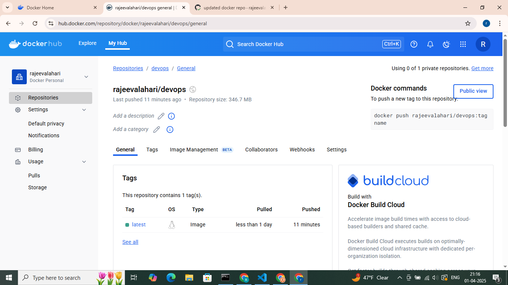

# DevOps - Automated Builds & Pushing to Docker Hub
---
I have used GitHub Actions to implement a CI/CD workflow that automatically tests, builds, and pushes a Docker image to Docker Hub.
---

## Repository Setup

- **GitHub Repo:** Created from scratch with the complete project code and configuration files.
- **Docker Hub:** My Docker Hub account is used to host the built image. The image is pushed automatically using GitHub Actions.

---

### Key Points

- **Testing Job:**  
  The `test` job installs dependencies and runs tests (using `pytest`) to verify that the code is functioning as expected.

- **Build and Push Job:**  
  The `build-and-push-docker` job is set to run only if the test job passes. It logs into Docker Hub using secrets (`DOCKERHUB_USERNAME` and `DOCKERHUB_TOKEN`), builds the Docker image, and pushes it to your Docker Hub repository.
---

## Screenshots

1. **Docker Hub Image:**  
   Below is a screenshot of the image published in my Docker Hub account:

   
